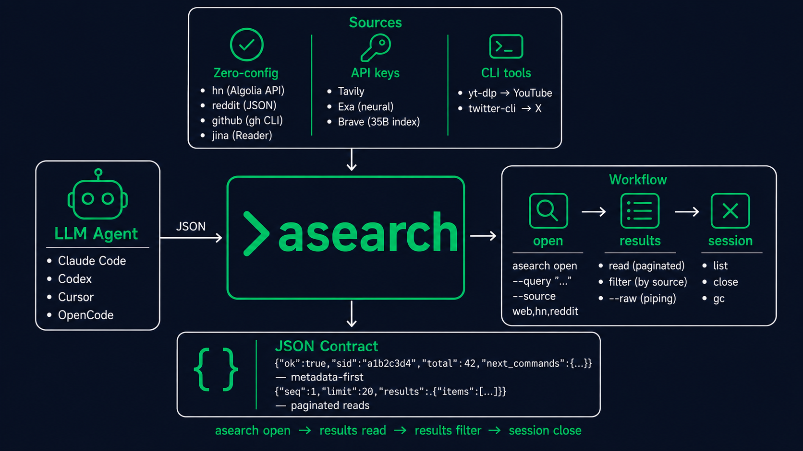

# asearch

[](https://www.npmjs.com/package/agent-asearch)
[](LICENSE)

Language: [Русский](README.md) | English

`asearch` — multi-source search CLI for LLM agents.

Built on the same principles as [`assh`](https://github.com/izzzzzi/agent-assh) (SSH) and [`aget`](https://github.com/izzzzzi/agent-aget) (browser): always returns JSON, session-based workflow with `sid` and `next_commands`, token-efficient paginated reads.



## Quick Start

```bash
npm i -g agent-asearch

# Free sources work immediately
asearch open --query "claude code plugins" --source hn,reddit

# For web search, add any one API key:
export TAVILY_API_KEY="tvly-..."    # tavily.com — AI-optimized
export EXA_API_KEY="..."            # exa.ai — neural/semantic
export BRAVE_API_KEY="BSA..."       # brave.com/search/api — 2000 free/month

# With a key — full web search
asearch open --query "claude code plugins" --source web,hn,reddit,github
```

`open` returns a session id and `next_commands`:

```json
{
  "ok": true,
  "sid": "a1b2c3d4",
  "session": "claude-code-plugins",
  "sources": ["web", "hn", "reddit"],
  "total": 42,
  "next_commands": {
    "read": "asearch results read -s a1b2c3d4 --limit 20",
    "filter": "asearch results filter -s a1b2c3d4 --source reddit",
    "close": "asearch session close -s a1b2c3d4"
  }
}
```

Continue through the results API:

```bash
asearch results read -s a1b2c3d4 --seq 1 --limit 20
asearch results filter -s a1b2c3d4 --source reddit
asearch results read -s a1b2c3d4 --raw | head -50
asearch session close -s a1b2c3d4
```

## What open does

`asearch open`:

- parses `--source` and selects available search backends;
- for `web`, checks API keys in order: Tavily → Exa → Brave → SearXNG;
- runs search in parallel across all selected sources;
- saves results locally for paginated reading;
- returns `sid`, `total`, and `next_commands`.

## Sources

| Source | Out-of-box | Requires |
|--------|:----------:|----------|
| **web** | ✅ | Auto-delegates: Tavily → Exa → Brave → SearXNG |
| **hn** | ✅ | Algolia HN Search API (free, no key) |
| **reddit** | ✅ | Public JSON API (no key) |
| **github** | ✅ | `gh` CLI (no key for public repos) |
| **jina** | ✅ | URL → markdown reader (jina.ai, no key) |
| **tavily** | 🔑 | `TAVILY_API_KEY` — AI answers + structured search |
| **exa** | 🔑 | `EXA_API_KEY` — neural/semantic search |
| **brave** | 🔑 | `BRAVE_API_KEY` — 35B-page index |
| **youtube** | 🔧 | `brew install yt-dlp` |
| **twitter** | 🔧 | `pipx install twitter-cli` |

## Commands

- `asearch open --query Q --source SRC` — start a search session.
- `asearch results read -s SID --seq N --limit M` — paginated read.
- `asearch results filter -s SID --source SRC` — filter by source.
- `asearch session list|close|gc` — session management.
- `asearch doctor` — check available backends and API keys.
- `asearch prompt` — LLM agent instructions.
- `asearch version` — version metadata.

## Token economy

Check metadata first, then read only what you need:

```bash
asearch open --query "rust async benchmarks" --source web,hn
# → {"ok":true,"sid":"...","total":42,...}

asearch results read -s SID --seq 1 --limit 10
asearch results read -s SID --seq 11 --limit 10
asearch results filter -s SID --source hn
```

Use `--raw` for piping:

```bash
asearch results read -s SID --raw | grep "tokio"
```

## Agent CLI examples

Paste this into Codex, Claude Code, OpenCode, or any terminal agent:

```text
Use `asearch` for search tasks.

Check available backends first:
asearch doctor

For quick search without keys, use hn and reddit:
asearch open --query "your topic" --source hn,reddit

For full web search, set a key:
export TAVILY_API_KEY="tvly-..."
asearch open --query "your topic" --source web,hn,reddit,github

Save the returned sid. Read results in small pages:
asearch results read -s SID --seq 1 --limit 20

Filter by source before reading:
asearch results filter -s SID --source reddit

For piping, use --raw:
asearch results read -s SID --raw | head -50

Always close the session:
asearch session close -s SID
```

Short versions for popular CLIs:

```text
Codex: Use `asearch` for search. Start with `asearch doctor`, then `asearch open --query "..." --source web,hn`. Keep sid, read via `asearch results read -s SID --seq 1 --limit 20`, filter via `asearch results filter`. Close session.
```

```text
Claude Code: Before search, install/run `asearch`. Use `asearch open --query "..." --source web,hn,reddit`, keep sid, paginate through `asearch results read`, filter by source, close session.
```

```text
OpenCode: Use `asearch open`, then `asearch results read/filter` with returned sid. Don't mix sids across sessions. Run `asearch doctor` to check backends.
```

## Security

- Search queries are not written to audit logs.
- Sessions and results stored locally in `~/.asearch/`.
- GitHub token read from `GITHUB_TOKEN` or `GH_TOKEN`.
- API keys accepted only via env vars. No `--api-key` flags.
- Jina Reader works without a key (rate-limited); key lifts limits.

## Pros

- One command to search across 10 sources.
- Stable JSON responses for agent parsing.
- Token-efficient: metadata first, paginated reads.
- Session-based workflow with `sid` and `next_commands` — same as `assh` and `aget`.
- 5 sources work without API keys.
- Pluggable backend architecture — each source is a separate Go struct.
- Go single binary — no Python, no Node, no Docker.

## Limitations

- `web` without an API key shows setup instructions instead of results.
- Reddit public JSON may rate-limit without cookies (`rdt-cli` recommended).
- Twitter requires `twitter-cli` with cookie auth.
- YouTube requires `yt-dlp`.

## Manual install

`npm i -g agent-asearch` installs a wrapper that downloads the matching Go binary from GitHub Releases. Archives can be downloaded manually:

```text
https://github.com/izzzzzi/agent-asearch/releases
```

Or build from source:

```bash
git clone https://github.com/izzzzzi/agent-asearch
cd agent-asearch
go build -o asearch ./cmd/asearch
```

## License

MIT
